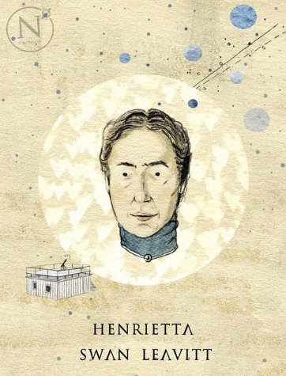
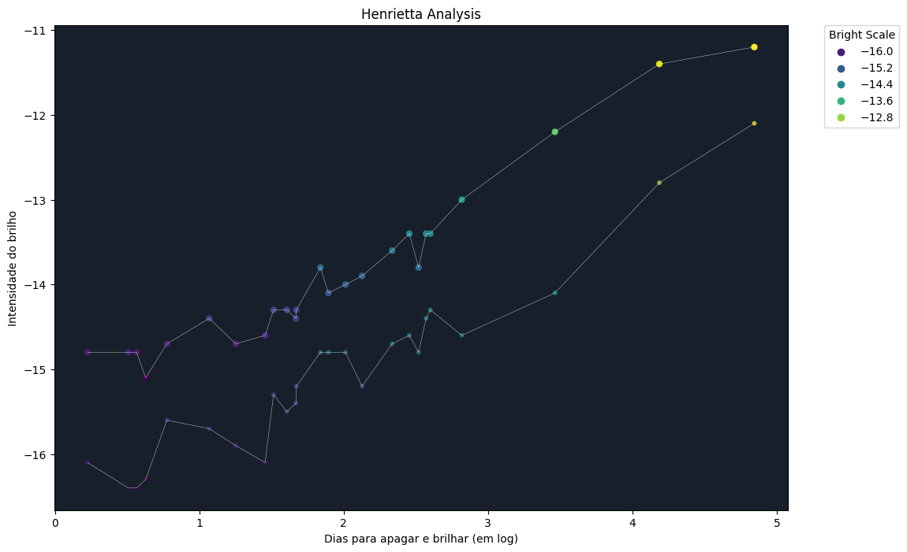

# Henrietta & The Stars

Arte extraída [daqui](https://www.instagram.com/p/Bqic5KaAz-m/?img_index=1)

Neste repositório, será replicada a análise de Henrietta Swan Leavitt, uma estudiosa dos cosmos que, quando analisou e documentou as estrelas da nebulosa Pequena Nuvem de Magalhães, e obteve um valioso _insight_ que revolucionou a aferição de distância de variáveis nos cosmos. 

A maior parte do esforço de replicação do estudo, envolve e pegar o artigo de 1912 (!), e escrever manualmente a base de dados para posterior visualização dos dados, tal como está no artigo. Tal artigo é bem curto, possui 3 páginas, e vai direto ao ponto para mostrar a alta correlação entre a quantidade de dias para uma estrela brilha e apagar e a intensidade do brilho desta. 

Esta significativa correlação permitiu responder um questionamento antigo que perpassava a cabeça de muitos estudiosos que olhavam as estrelas no céu: 

> Essa estrela que brilha forte à noite, ela está próxima da Terra, mas é uma estrela pequena, ou... é uma estrela gigantesca, mas que está distante do nosso sistema solar?

A resposta reside no **tempo que uma estrela demora para brilhar e apagar**, ou seja, a velocidade com a qual a estrela brilha e apaga (pulsar) prediz o tamanho dela. Se ela demora 2 dias para pulsar o brilho dela, ela é uma estrela pequena, mas se demora, mais de 9 meses para brilhar e apagar, significa que ela é uma estrela grande! Ao analisar a velocidade do pulsar da estrela, podemos responder tal questionamento. 

Estes desdobramentos não são feitos no artigo, mas graças à relação descoberta pela Henrietta, foi possível calcular com precisão a magnitude do brilho da estrela, e dessa forma, usar as diferenças entre as maginutudes aparente e precisa para aferir a distância do objeto. Isto é um método que revelou uma alternativa ao uso de paralaxe, tradicionalmente usada para calcular a distância. 

